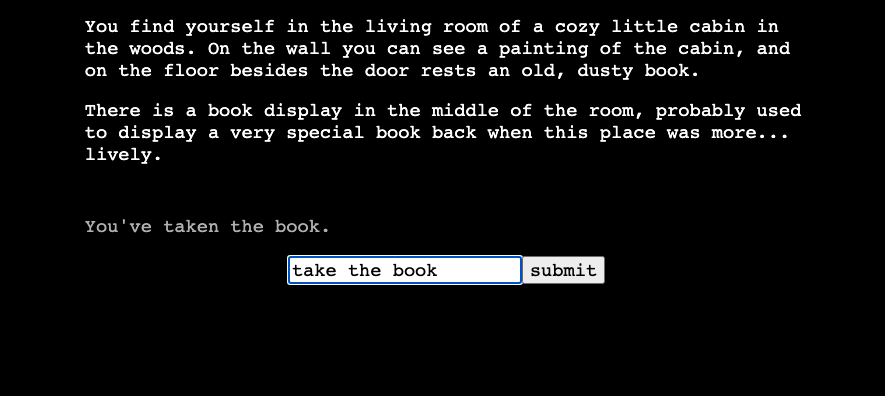

# Paignion



Paignion is a Python-generated, p5js-powered game engine for text adventure games.

---

## Contents

 - [Quick start](#quick-start)
 - [What is Paignion?](#what-is-paignion)
    - [How to write room descriptions](#how-to-write-room-descriptions)
    - [How to write room metadata](#how-to-write-room-metadata)
        - [Tangible and intangible items](#tangible-and-intangible-items)
        - [Item properties](#item-properties)
        - [Actions](#actions)
 - [How to install Paignion](#how-to-install-paignion)

---

## Quick start

If you just want to play a game made with Paignion to see what it can do, you can clone
this repo and build the example games locally to test them:

```text
$ git clone https://github.com/kokkonisd/paignion
$ cd paignion
$ python3 -m pip install -r requirements.txt # Install dependencies
$ python3 -m paignion build examples/complete_demo # Build demo game
```

This will build the complete demo at `examples/complete_demo/build`. You can play it by
serving it locally, for example with `http-server`:

```text
$ cd examples/complete_demo/build
$ http-server -p 4000
```

You can then open a browser, go to `localhost:4000` and enjoy :)

## What is Paignion?

Paignion is a game engine for
[text adventure games](https://en.wikipedia.org/wiki/Text-based_game#Text_adventure).
It takes a bunch of specifically formatted Markdown files written by you, the game
developer, and turns them into a JavaScript-based text adventure game, which you can
easily send to friends or serve on your site. You only need to install Paignion in
order to _make_ games; the actual game runs in a browser and does not have any
dependencies you need to install.

If you want to see a minimal example of a game built with Paignion to witness with your
own eyes how simple it is to create a game, you can follow the
[installation instructions](#how-to-install) to install Paignion on your computer.
Once it is installed, you can run the following command in your terminal to create a
new game:

```text
$ paignion init my_new_game
```

A directory called "my_new_game" will be created, and some default files will be
generated:

```text
$ tree my_new_game/
my_new_game
└── rooms
    ├── origin.md
    └── second_room.md

1 directory, 2 files
```

As you can see, a directory called "rooms" has been created inside the directory of
your game, and it contains all of the rooms of your game in the form of Markdown
(`.md`) files.

You must **always** have an `origin.md` room; this is the room in which the player
starts when they launch the game.

As you can see, every room file is split into two parts: a YAML header and a Markdown
body. This is basically based on
[Jekyll's Front Matter](https://jekyllrb.com/docs/front-matter/).

The YAML header is contained in triple dashes (`---`); it must always come first, and
the Markdown body must always come after it.

The YAML header basically contains metadata for the room (which rooms it connects to,
what items it contains, the properties of these items etc). The Markdown body contains
the description of the room, which is the text shown to the player when they enter the
room.

### How to write room descriptions

Room descriptions are written in basic Markdown. You can use pretty much anything you
would use here on GitHub when writing them.

Note that the player will not get a list of the items of the room as they enter it;
they will only get what you give them in the description. You can describe the items in
detail to invite them to examine them, or you can do the opposite and let the player
discover them by looking around the room.

### How to write room metadata

Room metadata is entirely optional. However, if all your rooms are completely empty
then your game isn't going to be much fun.

Each entry of room metadata is basically one of two elements: **directions** or
**items**. _Directions_ refer to the rooms that this room links to, and _items_ refer
to the items that are found in the room and that the player can interact with.

Directions are one of `north, east, south, west, up, down`; you do not need to specify
each and every one of them, you only need to specify those you need. For example, if I
want my origin room to link to the kitchen on its north, I can write:

```yaml
---
north: kitchen
---
```

assuming I will create a `kitchen.md` room. Usually you'll want to mirror this in the
linked room, by adding `south: origin` in `kitchen.md` in this case, but you do not
have to; you're making a game, not working on a uni assignment! Screw coherence and
continuity, go nuts!

Just to make it clear how this works, if we were to implement the two `origin.md` and
`kitchen.md` room, the player could move from the origin to the kitchen by typing
"go north" or "go to the north" or "move to the north" etc.


#### Tangible and intangible items

Items are split into two categories: _tangible_ and _intangible_. Tangible items are
the ones that the player can pick up and store in their inventory, like a key or a gun.
Intangible items on the other hand cannot be picked up by the player, and can instead
be examined by them, like a painting or a fireplace. Both types of items can be used
together, via [actions](#actions). Here's how you would declare that in the room files:

```yaml
---
items:
    tangible:
        # Tangible items go here
    intangible:
        # Intangible items go here
---
```

As with the directions, you don't need to define either of those categories if you
don't plan on using them; for example, if you don't want intangible/tangible items you
don't need to specify an empty list, and if you don't want neither the one nor the
other you can skip the items key in the YAML entirely.

#### Item properties

Each item, tangible or intangible, can define a few properties. For example, every item
should have at least a name and a description. Item descriptions can also contain
Markdown (just like the room descriptions).

The rest of the item properties are optional, which means you only need to define them
if you want to override the defaults. The optional properties are the following:

- `amount`: the amount of instances of this item found in this room. For example, you
  can have three gold coins, and let the player pick as many as they want. This is set
  to 1 by default (since if you don't specify how many of it there are then you
  probably mean there is just one) but can be set to any number, or "inf", which means
  that there is an infinite amount of this item. This can be used for things like
  grains of sand on a beach or something, I don't know.
- `visible`: is this item visible by the player or not? Basically this determines if
  the item will be filtered out or not if the player asks to "look around the room".
  This can be useful for things that are obviously there: for example you might want
  the player to be able to, say, combine a shovel and the ground in order to dig a
  hole by saying "use shovel with ground", but at the same time if they ask to look
  around the room it's dumb to respond "you can see one shovel and one _ground_", hence
  the utility of the `visible` flag.
- `effect`: the effect that is currently applied to an object. For example, if you
  enchant a sword it becomes _sword (enchanted)_. If you put a cat under a running sink
  it becomes _cat (wet)_. This usually starts out undefined and gets changed by an
  action, either for comedic/worldbuilding purposes or for an actual action that
  changes something in the game.

Here are some concrete examples of items:

```yaml
---
items:
    tangible:
        - name: rock
          description: "A rock you can pick up and probably throw at something."
        - name: boot
          description: "An old boot. Kinda stinks."
          amount: 2 # It's a pair of boots!
        - name: sand
          description: "Sand. You know what sand is. What you would do with this, I do not know. Have fun endlessly picking up grains of sand."
          amount: "inf"
          effect: boring
    intangible
        - name: sky
          visible: false # it would be dumb to say "there is 1 sky" to the player
                         # also note how if it's invisible you do not need to define a
                         # description since the player cannot say "look at the sky"
                         # (they will get a "there is no such item" answer)
        - name: boat
          description: "An old, rotting wooden boat. Seems it washed up on the shore a long time ago."
---
```

#### Actions

There is another (pretty important) item property: _actions_. You would have a pretty
boring game if the player could not change the game world via their actions, wouldn't
you?

Each time you want an item to be able to be used with another item, you must specify
the `used_with` property (and the properties that come along with it). Under this, you
must at least specify what the name of the item that this item interacts with is, and
also an effect message that is shown to the player when the action is carried out. The
last one is mandatory because not giving your players feedback is _bad_.

The syntax of the commands is very minimal, and there are actually only two commands
for now: `set` and `add` which, well, set a certain property to a certain value or
add (meaning _append_) something to the current value of a specific property. Let me
explain with an example.

Say we're making a very simple 2-room game. The player starts out in the origin of
course, which only contains one key (tangible) and one door (intangible) on its west
side. The goal for the player is pretty simple: pick up the key, open the door, and get
to the second room. This is how you'd implement this with actions:

```yaml
---
# we do not define anything for the `west` direction; it will get populated
# automatically by the action
items:
    tangible:
        - name: key
          description: "A simple key. I'm pretty sure it opens that door over there. Wanna pick it up?"
    intangible:
        - name: door
          description: "A classic wooden door. It's locked."
          used_with:
              - name: key
                effect_message: "The door is now unlocked."
                consumes_subject: true
                actions: "set west to second_room for origin; add <p>The door has been unlocked.</p> to description for origin"
---

There is a locked door to your west and a key at your feet. You know what to do.
```

Of course, I am assuming that there is a `second_room.md` whose `east` direction points
to `origin`. In order to advance to the second room, the player must type something
like "take the key" in order to pick up the key and then something like "use key on
door" in order to unlock the door. At that point, the action we just wrote for the door
will be applied: it will delete the key from the player's inventory (this is done
because of `consumes_subject`, more on that later), it will set the `west` direction of
the origin room to `second_room`, linking the two, and finally it will append a
paragraph saying "The door has been unlocked." to the origin's description, so that if
the player comes back later and don't remember that they already unlocked the door, the
description will remind them. Of course, in this case I'm using the `add` command to
show how it's supposed to be used, but in this case it would be better to just change
the entire description to that paragraph. You decide.

In any case, there are two commands:

- `set X to Y for Z`
- `add Y to X for Z`

`X` is a property/key: something like `west`, or `effect`, or `visible`, or `amount`...

`Z` is either a room name or an item name (tangible or intangible). The engine will
look for a room first, then for an item from the player's inventory, and lastly for an
intangible item, first from the current room and then from the other rooms. Keep this
order in mind when designing; only the first item in that order will be acted upon.
As for why the engine only looks for intangible items outside the player's inventory:
if the action is meant for a tangible item, the user can pick it up and use it. There
is no need to do this without having the user pick the item up first.

Finally, `Y` is a string containing a message or a value for the key `X`.

To conclude, here is the rest of the available properties for the actions:

- `consumes_subject`: decreases the amount of the subject (meaning the item
  _performing_ the action) by 1, or deletes it if it was at 1.
- `consumes_object`: same thing, but for the object (meaning the item _receiving_ the
  action).


## How to install Paignion

You can install Paignion via `pip`:

```text
$ pip3 install paignion
```

You can then directly use it from your terminal. If you don't want to install it, you
can clone this repo and use it from within the repo itself:

```text
$ git clone https://github.com/kokkonisd/paignion
$ cd paignion
$ python3 -m pip install -r requirements.txt # Install dependencies
```

You can then launch it from inside the clone of the repo by running:

```text
$ python3 -m paignion init my_new_game # or build ...
```


## Developer notes

TODOs:

- Add Markdown parsing to messages in actions
- Add unit tests
- Verify actions code in the Paignion parser before building game
- Rewrite frontend engine in pure native JS
- Add conditional actions in frontend engine (`if X is Y for Z then...`)
- Add part explaining the frontend engine in README
